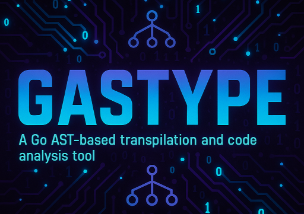

# 

---

**A Go AST-based transpilation and code analysis tool designed to optimize performance, reduce binary size, and increase code security through bitwise transformations and obfuscation.**

---

## **Table of Contents**

1. [About the Project](https://www.google.com/search?q=%231-about-the-project)
2. [Features](https://www.google.com/search?q=%232-features)
3. [Installation](https://www.google.com/search?q=%233-installation)
4. [CLI Usage](https://www.google.com/search?q=%234-cli-usage)
      - [Type Checking](https://www.google.com/search?q=%23type-checking)
      - [Transpilation](https://www.google.com/search?q=%23transpilation)
      - [Staged Transpilation Pipeline](https://www.google.com/search?q=%23staged-transpilation-pipeline)
5. [Transpilation and Optimization](https://www.google.com/search?q=%235-transpilation-and-optimization)
6. [Contributing](https://www.google.com/search?q=%236-contributing)
7. [License](https://www.google.com/search?q=%237-license)
8. [Contact](https://www.google.com/search?q=%238-contact)

---

### **1. About the Project**

Gastype (part of the Kubex project) is a powerful and flexible command-line tool for Go software engineers. It excels in static source code analysis (AST) to identify optimization opportunities and transform code automatically. The primary goal is to improve the performance, security, and efficiency of Go binaries, especially for production environments.

The tool offers a suite of transpilation "passes" that convert common, less-efficient code patterns into ultra-optimized bitwise operations.

### **2. Features**

- **Parallel Type Checking**: Execute type checks on multiple Go files simultaneously to ensure code quality in large projects.
- **Optimization Analysis**: Analyzes code and suggests optimizations, such as converting `bool` fields in `structs` to bitwise `flags`.
- **Automatic Transpilation**: Automatically transforms source code, applying optimization passes to generate a high-performance binary.
- **Code Obfuscation**: Obfuscates variable names, function names, and string literals to enhance security and make reverse engineering more difficult.
- **Control Structure Optimization**: Converts long `if/else` chains into "jump tables" for faster execution.
- **Staged Pipeline**: Provides a multi-stage workflow (`staged-transpilation`) that includes transpilation, validation, obfuscation, and a final build.

### **3. Installation**

**Requirements**: Go version 1.19 or later.

```bash
# Clone the repository
git clone https://github.com/rafa-mori/gastype.git
cd gastype

# Build and install the binary
make install
```

### **4. CLI Usage**

The `gastype` CLI is the central point for all operations.

#### **Type Checking**

- **`gastype check`**: Initiates type checking on Go files in a specific directory.
- **`gastype watch`**: Monitors a directory for file changes and automatically triggers type checking.

**Examples**:

```bash
# Runs type checking on the current directory with 4 workers
gastype check -d ./ -w 4 -o results.json

# Watches a project and sends email notifications in case of an error
gastype watch --dir ./my-project --email user@example.com --notify
```

#### **Transpilation**

- **`gastype transpile`**: The main command for transforming code. It supports various modes of operation.

**Examples**:

```bash
# Analyzes a project and displays optimization opportunities
gastype transpile --input ./src --mode analyze --format text

# Transpiles a single file, converting bool fields to bitwise flags
gastype transpile --input ./config.go --output ./config_optimized.go --mode transpile --passes bool-to-flags

# Transpiles an entire project with maximum obfuscation
gastype transpile --input ./my-app --output ./my-app-optimized --mode full-project --security 3
```

#### **Staged Transpilation Pipeline**

`gastype` provides a four-stage optimization pipeline to ensure code robustness.

1. **`gastype transpile --no-obfuscate`** (Stage 1: Clean Transpilation)
      - Creates an optimized version of the code without obfuscation, ideal for debugging and testing.
2. **`gastype validate`** (Stage 2: Validation)
      - Ensures the optimized code behaves identically to the original by running tests and verifying the build.
3. **`gastype obfuscate`** (Stage 3: Selective Obfuscation)
      - Applies obfuscation only to the parts of the code that passed validation.
4. **`gastype build`** (Stage 4: Final Build)
      - Compiles the final binary, applying Go compiler optimizations, stripping debug symbols, and optionally compressing the binary with UPX.

### **5. Transpilation and Optimization**

The heart of `gastype` lies in its transpilation "passes". Each pass is a modular AST transformation that can be enabled independently.

**Optimization Examples**:

- **`bool-to-flags`**: Converts structs with multiple `bool` fields into a single `uint64` field with bitwise flags, reducing memory consumption and improving cache locality.
- **`jump-table`**: Transforms chained `if/else` statements that compare the same variable into a map of functions, resulting in faster execution.
- **`string-obfuscate`**: Replaces string literals with byte arrays, making static analysis of the binary more difficult.

### **6. Contributing**

We appreciate your interest in contributing to `gastype`. Feel free to open `issues` or submit `pull requests`. Please refer to the [Contributing Guide](https://www.google.com/search?q=https://github.com/rafa-mori/gastype/blob/main/CONTRIBUTING.md) for more details.

### **7. License**

This project is licensed under the MIT License.

### **8. Contact**

- **Developer**: Rafael Mori ([faelmori@gmail.com](mailto:faelmori@gmail.com))
- **GitHub**: [https://github.com/faelmori](https://github.com/faelmori)
